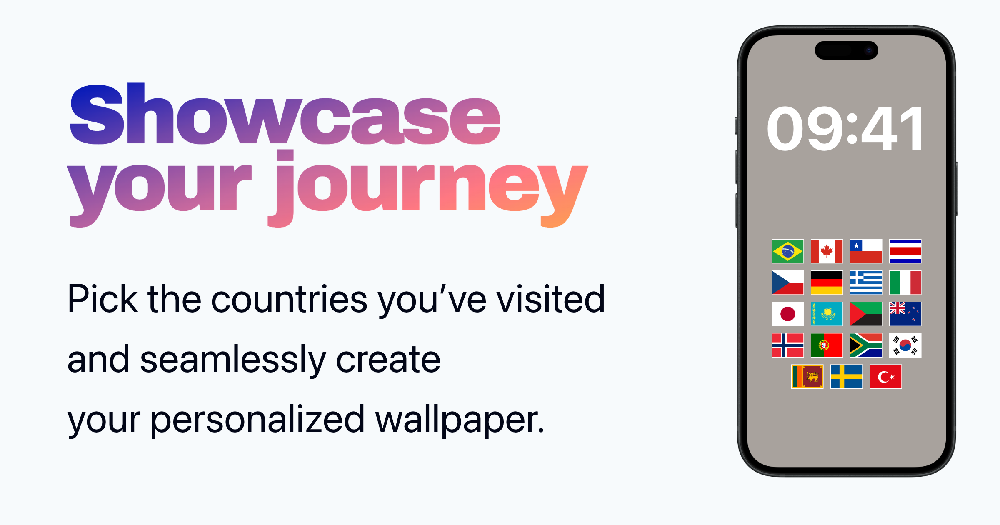

# flagwall

[](https://isqua.github.io/flagwall/)

I made this app for myself and friends. I wanted to put flags of visited countries on my phone's lock screen. That's why I made this simple application where you can select countries and background color, and download a picture with flags to your phone.

How to start application locally:

```bash
nvm use
npm ci
npm run dev
```

## Available Scripts

In the project directory, you can run:

### `npm run dev`

Runs the app in the development mode.\
Open [http://localhost:5173](http://localhost:5173) to view it in the browser.

The page will reload if you make edits.

Uses [Vite](https://vitejs.dev/).

### `npm run preview`

Serves the app in the production mode.\
Open [http://localhost:4173](http://localhost:4173) to view it in the browser.

Uses [Vite](https://vitejs.dev/).

### `npm run build`

Builds the app for production to the `build` folder.

Uses [Vite](https://vitejs.dev/).
